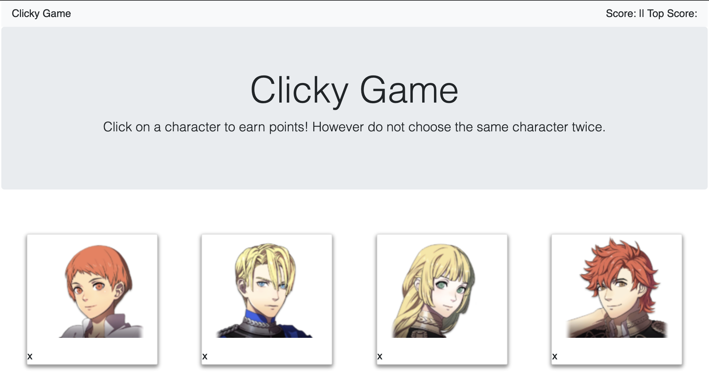

# Clicky-Game

## Summary

This project uses react a a way to build an application.

## Site Picture



## New Technologies Used

React - Javascript library for building user interface. Users are able write Javascript with html like code while using components and properties to connect to different files.

## Future Development

Fure developements include adding more characrters to increase the difficulty. Adding voice clips to make the game a bit more enjoyable. 

Improvments to styling to make the game look more pleasing.

## Challenges and Code Snippet 

There were plenty of challenges to this project. This ranged from sorting out and going through multiple files to creating certain functions. 

One challenge was trying get the score to show up on the browser. This puzzled me for a while becuase the score was showing up in the DOM. I realized that the props. were in the wrong placement in both the app.js file and Navbar index file. 

Another big challenge was trying to figure out how to create a shuffle function. This step is very important as it is what makes the game a challenge for the player. This took a lot of research time and error and trial for this function to work.

```js

shuffleCharacters = () => {
        this.characters = characters;
        this.count = function () {
            return this.characters.length;
        }
        for (var i = this.characters.length - 1; i >= 0; i--) {
            var randIndex = Math.floor(Math.random() * (i + 1));
            var tempCharacter = this.characters[i];
            this.characters[i] = this.characters[randIndex];
            this.characters[randIndex] = tempCharacter;
        }
        this.setState({
            characters
        });
    };